# Hora de Codar 2 || A Vingança de Coder
## 📖 Sobre a atividade

Após termirnar o Hora de Codar, o código contra-ataca com mais desafios a serem resolvidos!

## Exercício 01
Escreva um programa em que o usuário informe dois números utilizando o "prompt". Então escreva em tela o maior deles  
<a href="./tasks/task01.html">Resolução</a> 
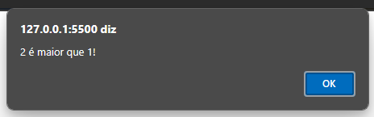

## Exercício 02
Faça um programa que leia um valor informado pelo usuário e diga se o valor informado é positivo, negativo ou zero.
 
<a href="./tasks/task02.html">Resolução</a>  
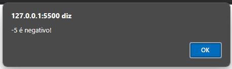

## Exercício 03
Faça um programa para ler 3 valores (considere que não serão informados valores iguais) e escrever o maior deles.
 
<a href="./tasks/task03.html">Resolução</a>  
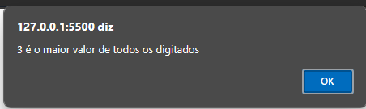

## Exercício 04
Faça um programa que leia 3 valores informados pelo usuário (considere que não serão informados valores iguais) e escrever a soma dos 2 maiores.
 
<a href="./tasks/task04.html">Resolução</a>  
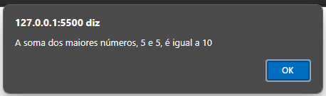

## Exercício 05
Faça um programa que leia 6 valores informados pelo usuário, calcule, exiba os números informados e escreva a média aritmética desses valores lidos.
 
<a href="./tasks/task05.html">Resolução</a>  
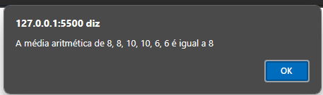

## Exercício 06
Faça um programa que receba quatro valores informados pelo usuário, mas informe somente o primeiro, o último e o maior de todos eles (considere que todos os números informados serão diferentes)
 
<a href="./tasks/task06.html">Resolução</a>  
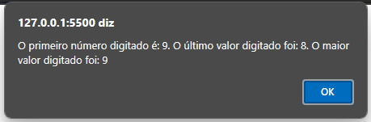

## Exercício 07
Faça um programa que leia 6 números que o usuário vai informar. Todos os números lidos com valor inferior a 72 devem ser somados. Escreva o valor final da soma efetuada e também todos valores que o usuário informou.
 
<a href="./tasks/task07.html">Resolução</a>  
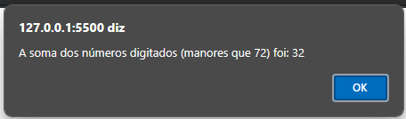

## Exercício 08
Escreva um programa que calcule a média de quatro números informados pelo usuário, mas somente se esses números forem maiores que 0 e menores que 10. No final, se a média for maior que cinco o usuário receberá uma mensagem "Você passou no teste". Em qualquer outra situação, ele receberá uma mensagem de "tente novamente"
 
<a href="./tasks/task08.html">Resolução</a>  
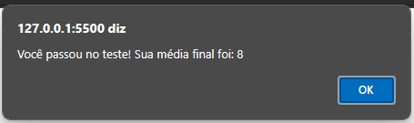

## Exercício 09
Escreva um programa para ler o ano de nascimento de uma pessoa e escrever uma mensagem que diga se ela poderá ou não votar este ano (não é necessário considerar o mês em que ela nasceu).
 
<a href="./tasks/task09.html">Resolução</a>  
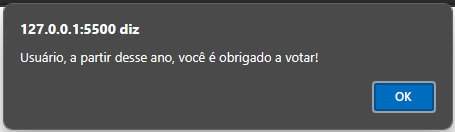

## Exercício 10
Tendo como entrada a altura e o sexo (codificando da seguinte dorma: 1: Feminino; 2: Masculino) de uma pessoa, construa um programa que calcule e imprima seu peso ideal, utilizando as fórmulas de peso ideal.
 
<a href="./tasks/task10.html">Resolução</a>  
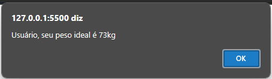

## Exercício 11
Escreva um programa para ler dois valores inteiros informados pelo usuário e uma das seguintes operações a serem executadas (codificadas da seguinte forma: 1. Adição; 2. Subtração; 3. Divisão; 4. Multiplicação)
 
<a href="./tasks/task11.html">Resolução</a>  
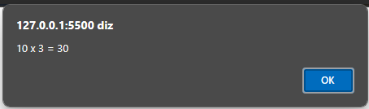

